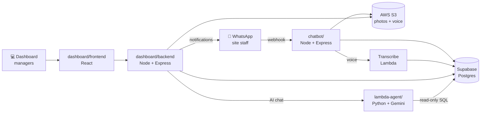

# ForeSites

**Snag management for construction sites, reported over WhatsApp.**

Site staff report defects ("snags") by messaging a WhatsApp number — a photo, a
voice note, or plain text. The snag lands in a shared database, gets assigned to
someone, and is tracked through to a signed-off resolution with proof. Managers
work from a web dashboard; everyone else stays in WhatsApp, which is the point:
the people who find problems on site don't have to learn new software.

An AI analytics layer sits on top, so you can ask "which site has the most open
electrical snags this month?" in plain English and get an answer with a chart.

Built by OMNIFEED.

---

## How it works



**The snag lifecycle:** reported on WhatsApp → triaged on the dashboard →
assigned to a worker (who gets a WhatsApp notification) → worker uploads proof
of resolution → manager approves, rejects with remarks, or escalates → snag
closes. Every state change can fire a WhatsApp message.

## The four subsystems

| Path | What it is | Stack | Runs on |
|---|---|---|---|
| [`chatbot/`](chatbot/) | WhatsApp bot — the reporting front door | Node, Express 5 | Always-on server (webhook must answer fast) |
| [`dashboard/backend/`](dashboard/backend/) | REST API, auth, assignments, notifications | Node, Express 5 | Server, port 9999 |
| [`dashboard/frontend/`](dashboard/frontend/) | The web dashboard | React 19, CRA | Static build, port 48317 in dev |
| [`lambda-agent/`](lambda-agent/) | AI analytics agent (text → SQL → chart) | Python 3.10+, Gemini | AWS Lambda |

Supporting directories:

| Path | Purpose |
|---|---|
| [`schema/`](schema/) | Canonical Postgres DDL — **run this first on a new environment** |
| [`config/`](config/) | Shared CSV/report paths, required by both Node apps |
| [`script-report/`](script-report/) | Python PDF report generator, invoked as a subprocess by the API |
| [`reports/`](reports/) | Append-only CSV data written at runtime |
| [`temp/`](temp/), [`promo-video/`](promo-video/), [`concepts/`](concepts/), [`logos/`](logos/) | Demo data, marketing video, design mockups, brand assets |

## Quick start

You need Node 20+, Python 3.10+, a Supabase project, an AWS account (S3), and a
Meta WhatsApp Cloud API app.

```bash
# 1. Database — run these in the Supabase SQL editor, in order
#    schema/001_omnifeed_schema.sql
#    schema/002_seed_data.sql

# 2. Configure. Every subsystem has its own .env.
cp chatbot/.env.example           chatbot/.env
cp dashboard/backend/.env.example dashboard/backend/.env
# then fill them in

# 3. Install (three separate installs — there is no workspace root)
cd chatbot           && npm install && cd ..
cd dashboard/backend && npm install && cd ../..
cd dashboard/frontend && npm install && cd ../..

# 4. Run
cd dashboard/backend  && npm start     # → :9999
cd dashboard/frontend && npm start     # → :48317
cd chatbot            && npm start     # → :4545, needs an ngrok tunnel
```

Log in at `http://localhost:48317` with `superadmin@admin.com` / `SuperAdmin@123`
— seeded automatically on first backend start. **Change it immediately.**

The WhatsApp bot needs more setup than this (a public tunnel, a Meta webhook, a
token that expires every 24 hours by default). **Read
[docs/SETUP.md](docs/SETUP.md) before you start on it** — it documents the
failure modes we've actually hit.

## Documentation

| Doc | Read it when |
|---|---|
| [docs/SETUP.md](docs/SETUP.md) | Setting up from scratch, or something won't start |
| [docs/ARCHITECTURE.md](docs/ARCHITECTURE.md) | Understanding how the pieces fit, or changing the schema |
| [docs/DEPLOYMENT.md](docs/DEPLOYMENT.md) | Deploying the Lambda agent or standing up a server |
| [docs/KNOWN-ISSUES.md](docs/KNOWN-ISSUES.md) | **Before debugging anything surprising** |

## A note on the repo

Dependencies, credentials and OS junk were committed early on and stayed in git
history for months. That history has been rewritten — `node_modules`, both
`.env` files, all `.DS_Store` and stray build artifacts are gone from every
commit, and the credentials that were exposed have been rotated.

Practical consequence: **every commit SHA changed.** If you have a clone from
before this cleanup, delete it and clone fresh. Pushing from an old clone
re-introduces everything that was removed.
