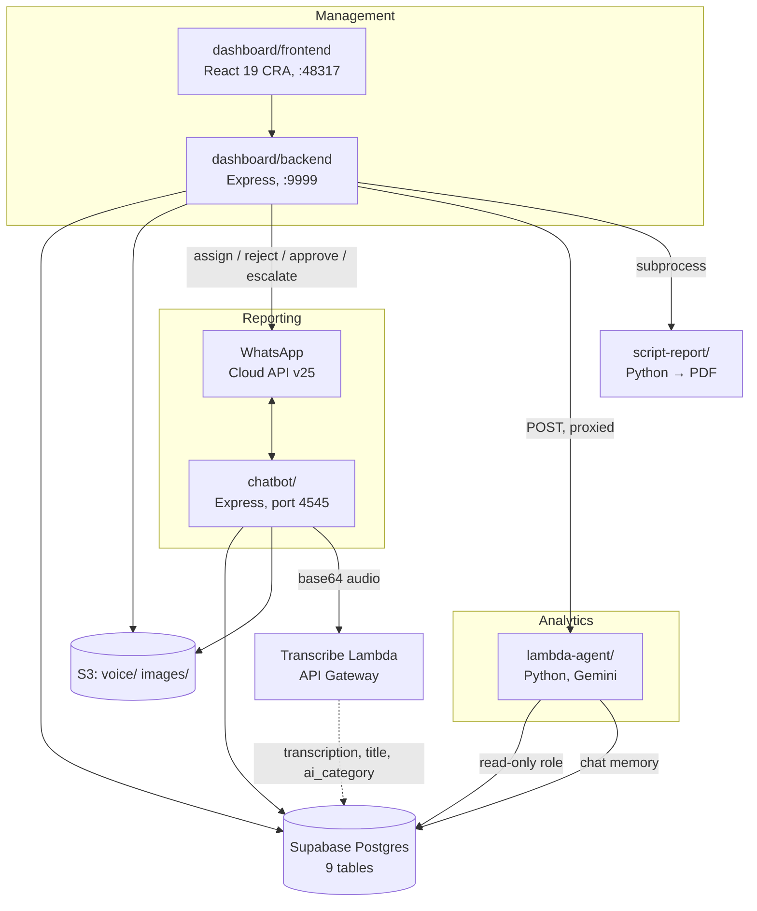
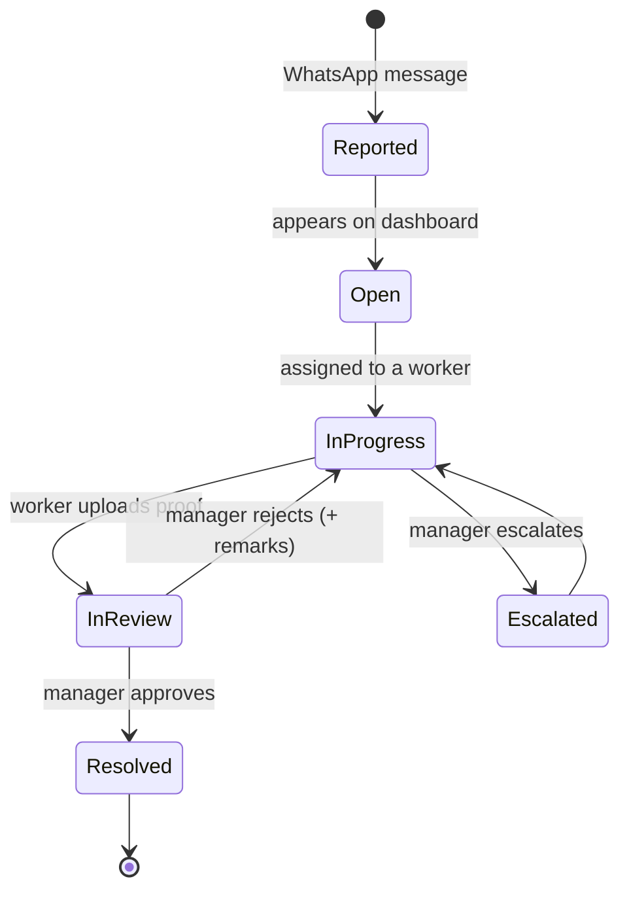
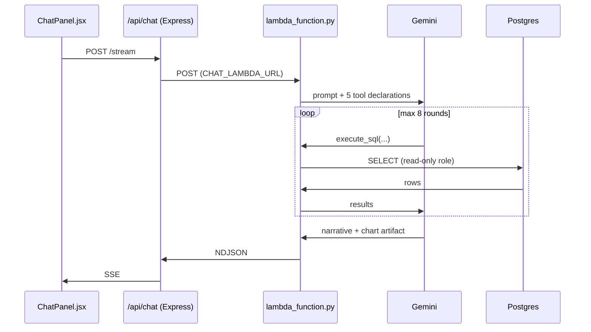

# Architecture

How the pieces fit together, and why they're arranged this way.

---

## Shape of the system

Four deployable units around one Postgres database. They share the database and
an S3 bucket; they do not call each other except where noted.



Two cross-directory dependencies stop the Node apps from being self-contained:

- Both require [`config/paths.js`](../config/paths.js) for the report CSV paths.
- Both read and write the repo-root `uploads/` directory (the chatbot writes media there before S3 upload; the backend serves it as a static fallback).

Anything that containerises or deploys `chatbot/` alone will break on these.

---

## The snag lifecycle

This is the domain model everything else serves.



Statuses are CHECK-constrained in the schema:

- `snag_assignment.status` ∈ `open` · `in_progress` · `in_review` · `resolved` · `rejected`
- `todo.status` ∈ `pending` · `in_progress` · `completed`
- `impact_category_mapping.impact_level` ∈ `low` · `medium` · `high` · `critical`
- `chat_message.role` ∈ `user` · `assistant` · `tool_call` · `tool_result`

A trigger (`trg_resolve_snag` → `resolve_snag_trigger()`) flips the parent
`snag.status` to `resolved` when an assignment gets `resolved_at`, so snag state
is derived rather than maintained in two places.

Rejections increment `rejection_count` and store `rejection_remarks`, which is
how repeat offenders surface. `is_active` enforces a single-active-assignee
model — added by `migrate-snag-card-refactor.sql`.

---

## Database

Nine tables. Every table below is queried by the backend; counts are `.from()`
call sites.

| Table | PK | Queried | Holds |
|---|---|---|---|
| `site` | `id` | 5 | Construction sites |
| `website_user` | `user_id` | 15 | Staff, roles, phone numbers |
| `snag` | `id` | 15 | Reported defects + media URLs + transcription |
| `snag_assignment` | `assignment_id` | 20 | Who's fixing what, status, proof |
| `todo` | `id` | 6 | Personal task list (WhatsApp-driven) |
| `chat_session` | `session_id` | 6 | AI chat threads |
| `chat_message` | `message_id` | 2 | AI chat turns + `chart_data` JSONB |
| `impact_category_mapping` | `id` | 3 | Category → impact level, editable |
| `mapping_change_log` | `id` | 3 | Audit trail for the above |

The **phone number is the join key** between WhatsApp and the dashboard: an
inbound message is matched against `website_user.phone_number` to identify the
sender. Unrecognised numbers are asked for a name and can still report.

Two RPCs (`dashboard_metrics`, `get_assignment_fingerprint`) are called but not
defined in this repo — see [SETUP.md §1](SETUP.md#1-database).

---

## Roles and authorisation

Ten roles, defined in three places that must stay in sync:
`AdminPanel.jsx:30-41`, the `website_user_role_check` constraint in the schema,
and the middleware in `Routes/auth.js:92-117`.

```
Super admin · Sr. engineer · Jr. engineer · Trainee · Safety
Site dw · Podium · Store · Sr. foreman · UWT & STP
```

(The schema also still permits legacy `admin` / `super_admin` / `user`.)

Three privilege tiers:

| Middleware | Grants |
|---|---|
| `requireSuperAdminLevel` (aka `requireAdmin`) | Super admin, Sr. engineer, + legacy admin roles |
| `requireSuperAdminOrSrEngineer` | Super admin, Sr. engineer |
| `requireSuperAdmin` | Super admin only — user deletion, impact-mapping edits |

Everything else is a plain authenticated user: they see the dashboard and their
own assigned jobs.

Auth is a custom JWT (24h) + bcrypt implementation, **not** Supabase Auth. The
token lives in `localStorage`; `AuthContext.jsx` verifies it on mount against
`GET /api/auth/verify` and hard-redirects to `/login` on any 401/403.
`ProtectedRoute.jsx` gates routes via `requireAuth` / `requireAdmin` /
`requireSuperAdmin` props.

> Note: `/api/report` and `/api/employee` sit outside this scheme entirely — see
> [KNOWN-ISSUES.md](KNOWN-ISSUES.md).

---

## API surface

All mounted under `/api` in `dashboard/backend/index.js:71-79`.

| Mount | Router | Routes | Auth |
|---|---|---|---|
| `/api/auth` | `auth.js` | — | mixed by route |
| `/api/dashboard` | `fb.js` | 9 | router-level JWT, `/health` exempted |
| `/api/snag-assignments` | `snagAssignment.js` | 16 | JWT on every route |
| `/api/sites` | `sites.js` | 8 | JWT on every route |
| `/api/todos` | `todo.js` | 6 | JWT on every route |
| `/api/chat` | `chatRoutes.js` | 5 | JWT + 30 req/min/user |
| `/api/impact-mapping` | `impactMapping.js` | 3 | JWT; writes are Super admin only |
| `/api/report` | `reportRoutes.js` | 1 | **none** — and it spawns a subprocess |
| `/api/employee` | `employee.js` | 4 | **none** — but dead (Mongoose, no connection) |

Plus a static `/uploads` mount serving the repo-root directory.

Note the two auth styles: `fb.js` protects itself with a single
`Router.use()` middleware that exempts `/health`, while every other router
attaches `authenticateToken` per route. Both work; the inconsistency is worth
knowing when adding a route, because a new route in `fb.js` is protected by
default and a new route anywhere else is not.

`POST /notify` and `POST /escalate` are **fire-and-forget**: they respond
`{success:true}` immediately, then do the user lookup and WhatsApp send
asynchronously. A failed notification never surfaces to the caller.

---

## The WhatsApp bot

A single-process, in-memory conversational step machine (`controller.js`, ~976
lines). Five menu options: report a snag, view my snags, add a todo, view
pending todos, mark a todo complete. Any of `hi` / `hey` / `hello` resets state
from anywhere.

Media flow: WhatsApp media ID → download from Graph API → write to `uploads/`
→ upload to S3 under `voice/` or `images/` → store the **public** S3 URL on the
snag row. Voice notes then go to a transcription Lambda **after** the row is
inserted, so a slow transcription never blocks the reply; the result is patched
back onto the row as `transcription`, `title` and `ai_category`.

Two structural consequences worth knowing:

- **State is process memory** (`userStates`, `processedMessages`). The service is single-instance only, and every restart — including each nodemon reload — drops in-flight conversations.
- **The webhook responds 200 before processing.** Meta requires a fast ack. Duplicate deliveries are de-duped by message ID in a `Set` with a 2-minute TTL.

The transcription endpoint URL is hardcoded in `controller.js:91`, not
configurable.

---

## The AI analytics agent

A text-to-SQL agent. React → Express proxy → Lambda Function URL → Gemini.



The Express layer is a thin authenticated proxy: it enforces JWT, rate-limits to
30 requests/min/user, persists sessions and messages to Postgres, and re-splits
the Lambda's NDJSON into SSE for the browser.

**Prompt construction.** `skill_loader.py` assembles the system prompt at cold
start from `lambda-agent/skill/` — an Anthropic-Skill-style package with a
`SKILL.md` persona plus six reference files (schema annotations, query patterns,
security rules, pgbouncer patterns, chart guidelines, and 732 lines of named
analytics recipes). It's roughly 11K tokens and is cached module-level.
`schema_introspect.py` reads the live schema with a 30-minute TTL cache, so the
agent tracks schema changes without a redeploy; `skill/references/schema.md` is
the fallback if introspection fails.

**SQL safety** (`tools/sql_tool.py`) is three layers, and comments are stripped
*before* validation so they can't be used to smuggle anything past it:

1. Regex blocklist — all DML/DDL, plus `pg_catalog`, `information_schema`, `pg_sleep`, `dblink`
2. Must start with `SELECT` or `WITH`
3. No embedded `;`

Results are capped at `LIMIT 100`, and `password_hash` / `passphrase` columns
are stripped from every result set. The connection uses a dedicated read-only
Postgres role.

Four artifact builders (`build_chart`, `build_table`, `build_kpi`,
`build_findings`) return plain dicts that land in `chat_message.chart_data` and
are rendered by Recharts in `ChatPanel.jsx`.

> Note: streaming is real inside `run_agent_stream`, but the Lambda handler
> collects every event before returning one joined body — so the "streaming" at
> the Lambda boundary is cosmetic despite the chunked header.

---

## Performance design

**Two-layer caching**, both 30-second TTL:

- *Server:* an in-process `Map` per `site_id` in front of `/dashboard-metrics` (`fb.js:245-255`)
- *Client:* `utils/dataCache.js`, shared across pages, so Dashboard ↔ All Snags navigation doesn't refetch

**Change detection instead of polling for data.** `useDataFreshness.js` polls
`GET /snag-assignments/last-updated` every 45 seconds for a cheap fingerprint.
On change it raises a sticky "New updates available" toast; accepting it busts
the whole client cache, refetches, and restores scroll position. This keeps the
dashboard live without repeatedly pulling full result sets.

The dashboard metrics endpoint itself was the original bottleneck — 33
sequential queries, collapsed to one RPC plus 4 parallel queries.

---

## Media

Snag photos, voice notes and resolution proof live in S3
(`eu-north-1`). The database stores a mix of full public S3 URLs and
`uploads/`-prefixed local paths, a legacy of the pre-S3 era.
`utils/resolveMediaUrl.js` normalises both down to a key;
`GET /api/dashboard/media-url` presigns it, falling back to the local static
mount when the object isn't in S3. `S3Image.jsx` and `ProofImage.jsx` consume
this.

---

## Configurable impact mapping

Snag categories map to impact levels (`low`/`medium`/`high`/`critical`), and the
mapping is data, not code. `App.jsx` fetches `/api/impact-mapping` on boot and
injects it into `utils/snagHelpers.js` via `setImpactMap()`; `getImpact()` falls
back to a hardcoded map for the first render. Super admins edit it in
`ImpactMappingPanel.jsx`, and every change is written to `mapping_change_log`.
